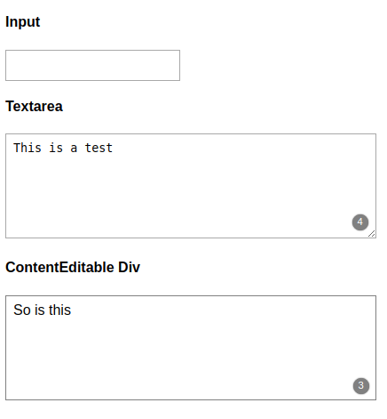

# True AI Technical Test

Congratulations for getting to this stage! The next step is to evaluate you on a small coding task to test your development and design skills.

At True AI, our mission is to use cutting edge Artificial Intelligence to help customer service agents be more productive by automating (fully or partially) laborious tasks, improving quality of life for the agents while enabling our clients to provide faster, better and affordable customer service.

## Task

This repo contains the boilerplate for a simple Chrome plugin, and a test harness for this code.  Your task is to extend the plugin to add a badge to each text `<input>`, `<textarea>` or `
` tag found on a webpage showing the current word count within the input.

An example of how this might look is shown below:

You will be assessed on following criteria:
- Quality of code (including legibility and comments)
- Quality of tests

Please make sure that you provide clear instructions to run your web app. 

Note: Please do not make this task or your solution to this task public (including Github), failing which, you will be disqualified.
